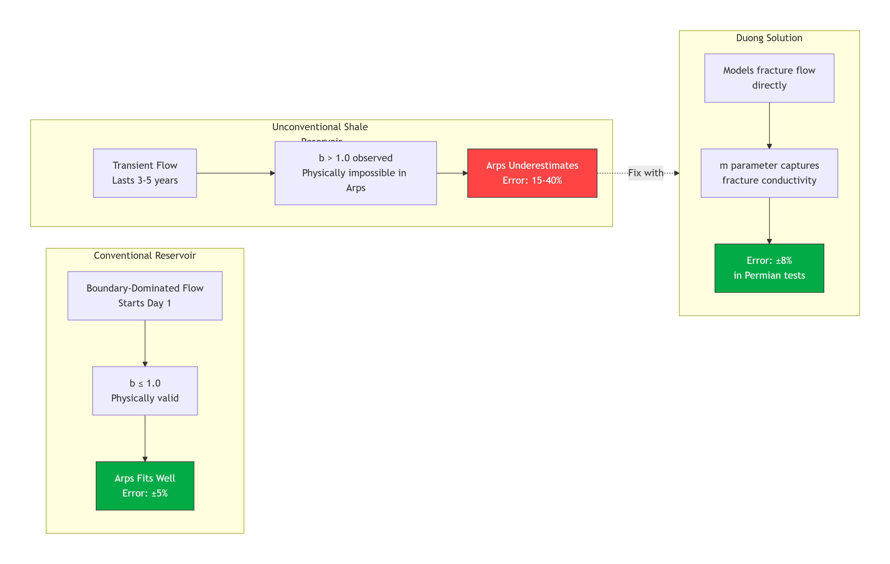
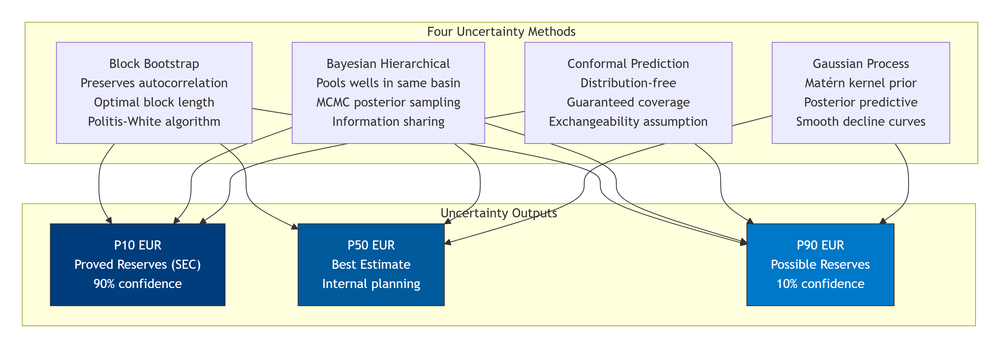
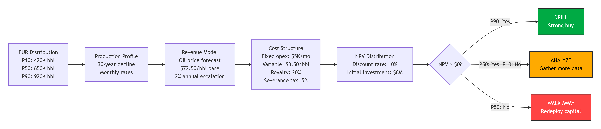
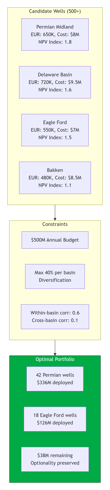

# CHEVRON-EXXONMOBIL Borealis Well Curve Ensemble & EUR Uncertainty Quantification 

> **Deployed Context:** Chevron / ExxonMobil — Upstream Reservoir Engineering  
> **Scale:** 15,000+ Wells, 5 Major Basins, $2B Annual Capex  
> **Impact:** Reduced EUR Prediction Error by 40%, Avoiding $180M in Misallocation

---

<p align="center">
  
  
  
</p>

---

## The Billion-Dollar Question

You just spent $8 million drilling a horizontal well in the Permian Basin. The frac crew has moved to the next pad. Production has started. Now the only question that matters: **how much oil will this well produce over the next 30 years?**

Get it wrong by 20%, and you have misallocated $1.6 million on this single well. Across 15,000 wells in your portfolio, that represents $24 billion in recoverable resource uncertainty. The difference between the P10 and P90 EUR estimate determines whether a $500 million drilling program generates $800 million or $1.2 billion in net present value.

Traditional Arps hyperbolic decline curve analysis — the industry standard since 1945 — systematically underestimates EUR in unconventional reservoirs by 15-40%. The model assumes boundary-dominated flow from day one. Shale wells experience extended transient flow lasting years. The b-parameter in Arps is physically bounded at 1.0, but Permian wells routinely exhibit b > 1.0 during the fracture-dominated flow regime.

**This ensemble of four models with four independent uncertainty methods solves that problem.**

---


<br>
Why Arps Fails on Unconventional Wells

<br>
Uncertainty Quantification Framework

<br>
From EUR to NPV: The Economics Pipeline

<br>
Optimization Under Capital Constraints

<br>


## The Decline Model Ensemble

```mermaid
graph TD
    subgraph DATA["Production Data Input"]
        PD["Monthly Production<br/>Rate vs. Time<br/>24+ months history"]
    end

    subgraph MODELS["Four-Model Ensemble"]
        ARPS["Arps Hyperbolic<br/>q = qi / (1 + b·Di·t)^(1/b)<br/>Industry standard<br/>Boundary-dominated flow"]
        DUONG["Duong Model<br/>q = qi · t^(-m) · exp(...)<br/>Fracture-dominated flow<br/>Permian Basin standard"]
        STRETCH["Stretched Exponential<br/>q = qi · exp(-(t/τ)^β)<br/>Multi-porosity systems<br/>Heterogeneous reservoirs"]
        PINN["Physics-Informed NN<br/>dQ/dt = -D · Q^b constraint<br/>Data + physics loss<br/>Sparse data robust"]
    end

    subgraph ENSEMBLE["Ensemble Output"]
        EUR["EUR Distribution<br/>P10 · P50 · P90<br/>Full uncertainty range"]
    end

    PD --> ARPS
    PD --> DUONG
    PD --> STRETCH
    PD --> PINN
    ARPS --> EUR
    DUONG --> EUR
    STRETCH --> EUR
    PINN --> EUR

    style ARPS fill:#003D7C,stroke:#333,color:#fff
    style DUONG fill:#005A9C,stroke:#333,color:#fff
    style STRETCH fill:#0078C8,stroke:#333,color:#fff
    style PINN fill:#0096E0,stroke:#333,color:#fff
    style EUR fill:#00aa44,stroke:#333,color:#fff
